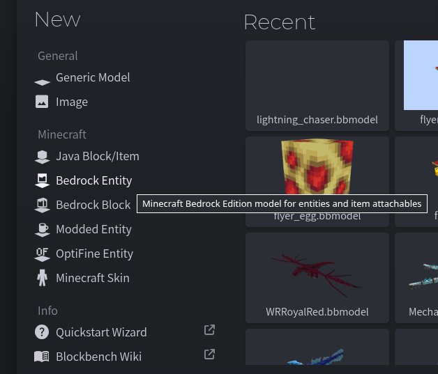
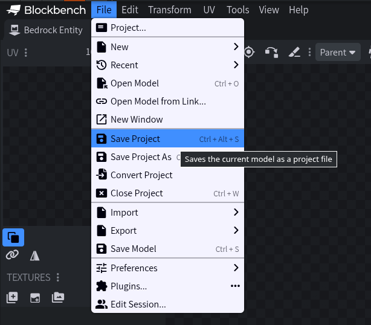
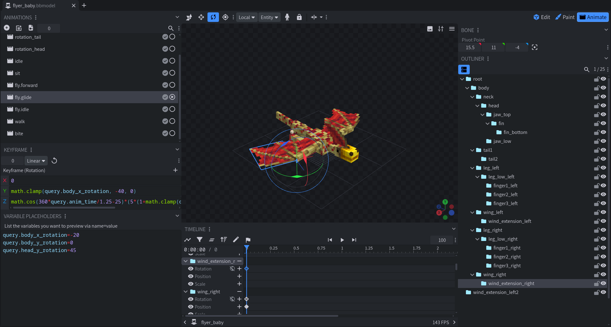
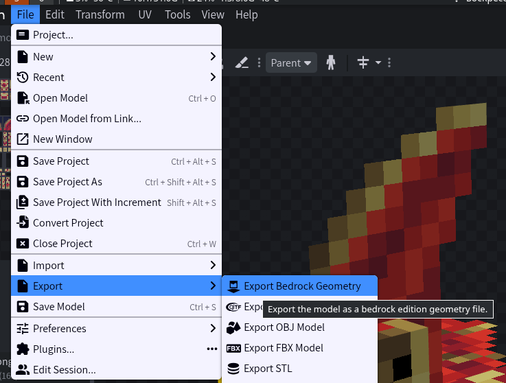

# Biscuit Roll
Animation library for Minecraft that utilizes Bedrock Geometry format and aims to support both client and server sides.
Currently, properly supports client side with possibility to load and use models on server side.\
Library depends on Fabric API and Fabric Loader

Project uses forks of [Molang Compiler](https://github.com/Ocelot5836/molang-compiler) and [Pinwheel](https://github.com/Ocelot5836/pinwheel), which contain several bugfixes to originals. Both forks are licensed under MIT license and original text of licenses can be found in `LICENSE_Molang_Compiler.txt` and `LICENSE_Pinwheel.txt` respectively.

# Usage
If you're player and mod you're using requires Biscuit Roll, you can download mod from either Curseforge or Modrinth
- **Modrinth**: TBA
- **Curseforge**: TBA

For developers wishing to add mod to your project, you can get information on that below

## Adding library to your project
Currently, project is not hosted on dedicated maven (because I'm procrastinating with setting it up). Thus, to use it in your project, you have to do one of the following:
1. Add locally: you can add library locally by doing the following:
   1. Create directory within your project root. For example, let's call it `libs`
   2. Add that directory to your repositories via `flatDir`
      ```groovy
      repositories {
        flatDir() {
            dir 'libs'
        } 
      }
      ```
   3. Place library jars to created folder. Sources jar can be obtained either from releases or additional files attached to version on either Modrinth or Cursefoge. Or alternatively, you can compile from source code and use jar files you got from project build
   4. Add library to your dependencies
      ```groovy
      dependencies {
        implementation ("nordmods.biscuit_roll:biscuit_roll:${project.biscuit_roll_version}")  
      }
      ```
      `biscuit_roll_version` is library version specified in your `gradle.properties` file

2. Use Modrinth maven. Open page of version you need and follow instructions listed in "Developer information" section

## Using library in the project
For implementation examples, check out mod's [test directory](./src/test/java/nordmods/testmod)
### Animated Object
Animated Object is an object that can be animated via animation controllers it has. It's important for animated object to be instanced, meaning animated object instance must be unique for each object that you want to animate. Otherwise, if animated object instance is shared between several objects, it will cause issues with animation management.

Examples of instanced objects in Minecraft:
- Entity
- Block Entity

It's safe to make those animated objects, as those objects are always instanced.

Examples of non-instanced objects in Minecraft:
- Non BE blocks
- Items

Those objects share their instance with multiple other objects (i.e. item will share its instance with every item stack that has it). Thus, if you try to animate those, you will have problems with properly delegating animations.
In general, it doesn't mean you can't make those animated objects, but you'll have a lot of limitations when doing so. And thus, such usage of animated objects is discouraged.

To make object an animated object, implement `BRAnimatedObject` interface:

```java
public class Drone extends Mob implements BRAnimatedObject {
    /*your other code*/
}
```

After that, you need to create one or several (depending on your use case) animation controllers and collection that contains all of them and will be returned by `getAnimationControllers()`

```java
public class Drone extends Mob implements BRAnimatedObject {
   private final BRAnimationController controller1 = new BRAnimationController(true) { //boolean parameter here is responsible for enabling single animation mode, with false it being set to disabled
      @Override
      protected void onSoundEffect(AnimationData.SoundEffect soundEffect, BRModel model, BRState state) {}

      @Override
      protected void onParticleEffect(AnimationData.ParticleEffect particleEffect, BRModel model, BRState state) {}

      @Override
      protected void onTimelineEffect(AnimationData.TimelineEffect timelineEffect, BRModel model, BRState state) {}
   };
   private final BRAnimationController controller2 = new BRAnimationController(false) {
      @Override
      protected void onSoundEffect(AnimationData.SoundEffect soundEffect, BRModel model, BRState state) {}

      @Override
      protected void onParticleEffect(AnimationData.ParticleEffect particleEffect, BRModel model, BRState state) {}

      @Override
      protected void onTimelineEffect(AnimationData.TimelineEffect timelineEffect, BRModel model, BRState state) {}
   };
   private final List<BRAnimationController> controllers = List.of(controller1, controller2);

   public WaterDragon(EntityType<? extends Mob> entityType, Level level) {
      super(entityType, level);
   }

   @Override
   public Collection<BRAnimationController> getAnimationControllers() {
      return controllers;
   }
}
```

Example above is taken from [Drone](./src/test/java/nordmods/testmod/common/entity/Drone.java) example

### Animation Controller
Animation Controller is an object that's responsible for managing animations it's playing. It's manages animation time, whether those playing animations supposed to run or stopped and executing animation events.
Execution of animation events can be adjusted for each controller individually by overriding methods responsible for their execution. Example below is taken from [Dragon](./src/test/java/nordmods/testmod/common/entity/Dragon.java) example
```java
        @Override
        protected void onSoundEffect(AnimationData.SoundEffect soundEffect, BRModel model, BRState state) {
            try {
                if (level().isClientSide()) {
                    playSound(
                            SoundEvent.createVariableRangeEvent(Identifier.tryParse(soundEffect.effect())),
                            DragonAnimationController.this.getEnvironment().resolve(soundEffect.pitch()),
                            DragonAnimationController.this.getEnvironment().resolve(soundEffect.volume())
                    );
                }
            } catch (MolangRuntimeException molangRuntimeException) {
                throw (new RuntimeException("Failed to play sound effect " + soundEffect.effect() + " at " + soundEffect.time(), molangRuntimeException));
            }
        }

        @Override
        protected void onParticleEffect(AnimationData.ParticleEffect particleEffect, BRModel model, BRState state) {
            if (level().isClientSide()) {
                LocatorTransformation transformation = model.getLocatorTransformation(particleEffect.locator());
                if (transformation != null) {
                    ParticleType<?> particleType = BuiltInRegistries.PARTICLE_TYPE.getValue(Identifier.tryParse(particleEffect.effect()));
                    if (!(particleType instanceof ParticleOptions particleOptions)) return;
                    Vector4f vec = transformation.matrix().transform(new Vector4f(0, 0, 0, 1));
                    //note: model rotation relative to entity's yaw is happening via transforming PoseStack during rendering
                    // in reality model itself is still facing same direction, so we have to rotate it by ourselves
                    Vector3f pos = new Vector3f(vec.x(), vec.y(), vec.z()).rotate(Axis.YP.rotationDegrees(180 - getYRot()));
                    level().addParticle(
                            particleOptions,
                            pos.x() + getX(),
                            pos.y() + getY(),
                            pos.z() + getZ(),
                            0, 0, 0);
                }
            }
        }

        @Override
        protected void onTimelineEffect(AnimationData.TimelineEffect timelineEffect, BRModel model, BRState state) {
           if (level().isClientSide()) {
               if (timelineEffect.data.equals("say") && Minecraft.getInstance().player != null) Minecraft.getInstance().player.sendSystemMessage(Component.literal("Something"));
           }
        }
```

If you don't have any events to run, you may as well leave them empty, like in example above

Animation controllers as well can be turned to single animation mode. Single animation mode makes it so only one animation can be active, which is last animation that has been submitted to the controller. When new animation is submitted, currently running animation is stopped and begin to transition out.

To play animation on a controller, you can use `BRAnimationController#playAnimation()`. 

### Creating Model
This library utilities Bedrock Geometry format for models. To create model of appropriate format, it's recommended to use Blockbench, although there are other ways to make them. But for simplicity, following tutorial will use only Blockbench.

**1. Creating project**\
Open Blockbench and select "Bedrock Entity"

After that, save your project in .bbmodel format. Saving in other formats may result in loss of some information when you decide to open your project again.

Tip: you can quickly save projects using `Ctrl + S` hotkey if you're using Blockbench as app on your PC

**2. Making the model**\
First of, let's start from elements that can be used and what they do.
- Group (Bone) - a collection of elements, can contain other groups within. It's also only animatable element of the model, practically being its "bone" if we speak in more traditional terms. Due to this fact, groups sometimes may be referred as "bones" in this tutorial.
- Cube - a model of cuboid that can be textured
- Poly Mesh - polygonal mesh. Note: you cannot manipulate position of vertexes during animation. If this is what you want from a library, consider looking for other options
- Locator - point that can be referenced from code or animation events

Unsupported elements:
- Texture Mesh
- Null Object - during export will be converted to Locator. You still can use it in your project for other things
- Anything else that is not listed in list of supported elements

As of learning modeling process itself, I suggest checking out this tutorial playlist: https://www.youtube.com/playlist?list=PLvULVkjBtg2SezfUA8kHcPUGpxIS26uJR

**3. Animating your model**\
Once you've done making your model, you can start animating it in "Animate" tab.

Since this library uses Bedrock Geometry format, it supports complex expressions for keyframes, also known as "Molang". More information on Molang can be found here: https://learn.microsoft.com/en-us/minecraft/creator/documents/molang/syntax-guide?view=minecraft-bedrock-stable. Just remember that in this library molang can be used only for animation\
Note: support for queries needs to be implemented from code side. Only query that is natively supported by library is `query.anim_time`. For easy implementation of some queries, you can check out [QueryHelper](./src/main/java/nordmods/biscuit_roll/common/animation/QueryHelper.java) class

Library does not support import of animation controllers, so all you need to do are animations.

Once you're done, don't forget to save animation. Saved .animation.json file is also one that will be used in the mod itself

**4. Exporting the model**\
Once you finished making your model, you need to export it in Bedrock Geometry format

Outputed .geo.json file is the one that will be used in your mod

### Rendering animated object
TODO